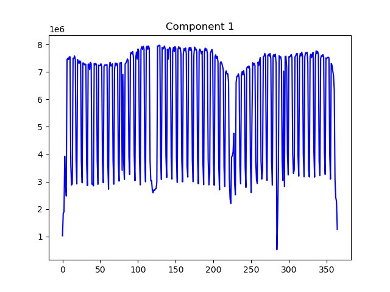
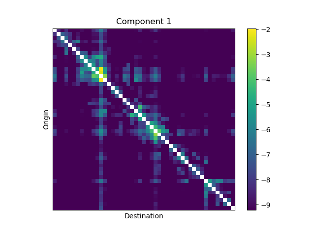
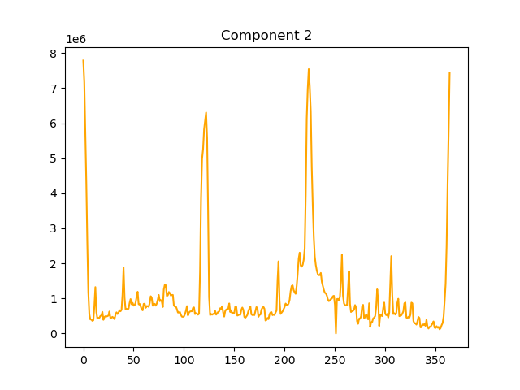
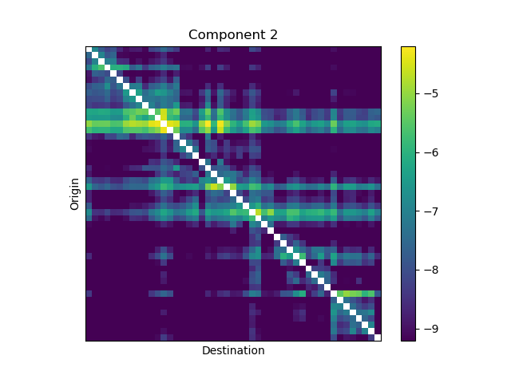
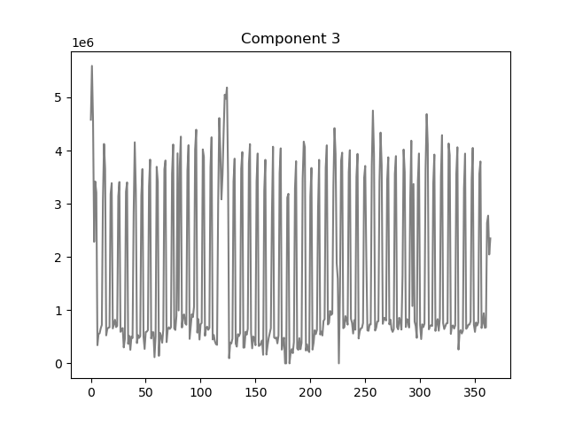
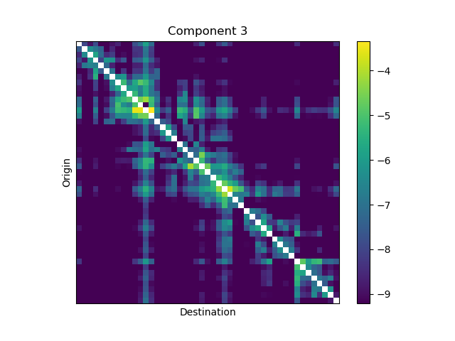

# Intercity-Travel-Pattern-Analysis-using-Non-negative-Matrix-Factorization

## Overview
This project is a part of my research on mobility pattern analysis and was converted from my MATLAB code to Python.\
This project demonstrates the ability of Non-negative Matrix Factorization (NMF) to extract hiddent latent pattern from high-dimension complexed data.

## Methodology
NMF decompose an non-negative matrix **V** (size: m x n) into 2 smaller non-negative matrices W (m x k) and H (k x n).
In this project NMF will extract mobility patterns from spatiotemporal data, with k set to 3.

## Data
Long-distance interprefecture traveler data between Japan's 47 prefectures in 2019.

## Result
The W matrix shows: Number of people traveling for each travel behavior over the time series.
The H matrix shows: The ratio of people traveling for each OD pair and each travel behavior.

Combining the information of matrix W and H from the NMF result, we achieved three travel behaviors:
### Component 1: Business

|W matrix|H matrix|
| :---: | :---: |
|  |  |

W_mat: increase on weekdays, decrease on weekends and public holiday. Hence, component 1 related to the weekdays factor.

H_mat: Component 1 has high travel number
+ between nearby OD (orgiginal-distance) paris (close-distance).
+ going to and from major prefectures likes Tokyo & Osaka & surroundings.

&rarr; Component 1 is related to Bussiness behavior.

### Component 2: VRF (Visiting relatives and friends)

|W matrix|H matrix|
| :---: | :---: |
|  |  |

W_mat: High peaks on New Year, Golden Week, Obon festival. Hence, component 2 related to these factors.

H_mat: Component 2 has high travel number
+ from big populations cities such as Tokyo area, Aichi, Osaka, etc.
+ from Fukuoka to others prefecture on Kyushu Island

&rarr; Component 2 is related to VRF behavior.

### Component 3: Leisure/Sightseeing

|W matrix|H matrix|
| :---: | :---: |
|  |  |

W_mat: rises on weekends, public holidays, drops on weekdays. Hence, component 2 related to holiday factors.

H_mat: Component 3 has high travel number
+ Between nearby OD pairs 
+ OD pairs related to famous tourist destination Tokyo area & Kyoto, Osaka,…
+ Within Kyushu Island

&rarr; Component 3 is related to leisure/sightseeing behavior.
